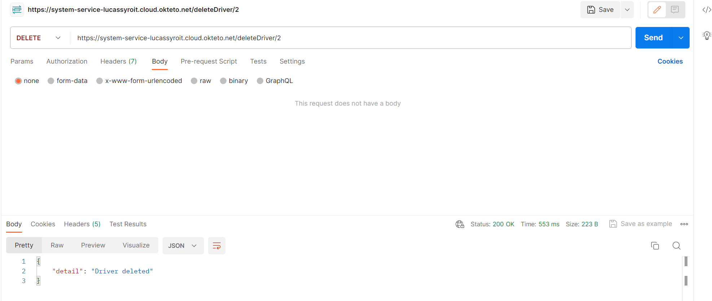

# API-RX

Project for class API Development

## Table of contents

1. [Theme](#theme)
2. [API Description](#api-description)
    1. [Postman](#postman)
    2. [API Docs](#api-docs)
3. [Hosted API](#hosted-api)

## 1. Theme

I have chosen for an API about RallyCross(RX) because this is one of my favorite motorsports in the world.
In addition, motorsport rallycross in general is one of the most data-rich sports in the world. 
You can do a lot with it and it is an easily expandable topic. 
You can look at other classes within rallycross. You can possibly work with results, teams, etc. in the API.

## 2. API Description

**main.py**


The API has two GET endpoints, one POST endpoint and one delete endpoint.

1. GET /drivers/ 
   - Description: Retrieves a list of all drivers.
   - Parameters:
     - skip (query parameter, optional): Number of records to skip.
     - limit (query parameter, optional): Maximum number of records to retrieve.
   - Response: Returns a list of driver objects (List[schemas.Driver]).
2. GET /drivers/{driver_id} 
   - Description: Retrieves details of a specific driver based on the provided driver_id.
   - Parameters:
     - driver_id (path parameter): ID of the driver to retrieve.
   - Response: Returns the details of the specified driver (schemas.Driver).
   - Error Handling: If the driver with the given ID is not found, it raises an HTTPException with a 404 status code.
3. POST /createDriver/ 
   - Description: Creates a new driver based on the provided data.
   - Request Body: Expects a JSON payload containing data for creating a new driver (schemas.DriverCreate).
   - Response: Returns the details of the newly created driver (schemas.Driver).
4. DELETE /deleteDriver/{driver_id}
   - Description: Deletes a driver based on the provided driver_id.
   - Parameters:
      - driver_id (path parameter): ID of the driver to delete.
   - Response: Returns a JSON response indicating the success of the deletion.
   - Error Handling: If the driver with the given ID is not found, it raises an HTTPException with a 404 status code.

```python
# Imports
from fastapi import Depends, FastAPI, HTTPException
from sqlalchemy.orm import Session
from fastapi.middleware.cors import CORSMiddleware
import os
import crud_operations
import models
import schemas
from database import SessionLocal, engine
from typing import List

# Database Initialization
if not os.path.exists('.\sqlitedb'):
    os.makedirs('.\sqlitedb')
models.Base.metadata.create_all(bind=engine)

# FastAPI App Setup
app = FastAPI()

# CORS Middleware Configuration:
origins = [
    "http://localhost/",
    "http://localhost:8080/",
    "https://localhost.tiangolo.com",
    "http://127.0.0.1:5500/",
    "http//lucassyroit.github.io/",
    "https://lucassyroit.github.io/",
    "https://lucassyroit.github.io/API-Project-RX-frontend/",
]

app.add_middleware(
    CORSMiddleware,
    allow_origins=origins,
    allow_credentials=True,
    allow_methods=["*"],
    allow_headers=["*"],
)

# Database Dependency
def get_db():
    db = SessionLocal()
    try:
        yield db
    finally:
        db.close()


# Get all drivers
@app.get("/drivers/", response_model=List[schemas.Driver])
def get_all_drivers(skip: int = 0, limit: int = 100, db: Session = Depends(get_db)):
    drivers = crud_operations.get_drivers(db, skip=skip, limit=limit)
    return drivers


# Get a specific driver
@app.get("/drivers/{driver_id}", response_model=schemas.Driver)
def get_driver(driver_id: int, db: Session = Depends(get_db)):
    driver = crud_operations.get_driver(db, driver_id=driver_id)
    if driver is None:
        raise HTTPException(status_code=404, detail="Driver not found")
    return driver


# Create a new driver
@app.post("/createDriver/", response_model=schemas.Driver)
def create_driver(driver: schemas.DriverCreate, db: Session = Depends(get_db)):
    return crud_operations.create_driver(db=db, driver=driver)


# Delete a driver
@app.delete("/deleteDriver/{driver_id}")
def delete_driver(driver_id: int, db: Session = Depends(get_db)):
    if not crud_operations.delete_driver(db, driver_id):
        raise HTTPException(status_code=404, detail="Driver not found")
    return {"detail": "Driver deleted"}
```

**database.py**

This code sets up the SQLAlchemy components for working with a SQLite database in a FastAPI application.

```python
from sqlalchemy import create_engine
from sqlalchemy.ext.declarative import declarative_base
from sqlalchemy.orm import sessionmaker

SQLALCHEMY_DATABASE_URL = "sqlite:///./sqlitedb/rallycross.db"

engine = create_engine(
    SQLALCHEMY_DATABASE_URL, echo=True, connect_args={"check_same_thread": False}
)
SessionLocal = sessionmaker(autocommit=False, autoflush=False, bind=engine)

Base = declarative_base()

```

**crud_operations.py**

This set of functions provides the basic CRUD (Create, Read, Update, Delete) operations for interacting with a database that stores information about drivers.

```python
from sqlalchemy.orm import Session
import models
import schemas


def get_drivers(db: Session, skip: int = 0, limit: int = 100):
    return db.query(models.Driver).offset(skip).limit(limit).all()


def get_driver(db: Session, driver_id: int):
    return db.query(models.Driver).filter(models.Driver.id == driver_id).first()


def create_driver(db: Session, driver: schemas.DriverCreate):
    db_driver = models.Driver(first_name=driver.first_name,
                              last_name=driver.last_name,
                              country=driver.country,
                              team=driver.team,
                              is_active=driver.is_active)
    db.add(db_driver)
    db.commit()
    db.refresh(db_driver)
    return db_driver


def delete_driver(db: Session, driver_id: int):
    driver = db.query(models.Driver).filter(models.Driver.id == driver_id).first()
    if driver is not None:
        db.delete(driver)
        db.commit()
        return True
    return False
```
**models.py**

This code defines a SQLAlchemy model for the Driver entity in a database

```python
from sqlalchemy import Column, Integer, String, Boolean

from database import Base


class Driver(Base):
    __tablename__ = "driver"

    id = Column(Integer, primary_key=True, index=True)
    first_name = Column(String, index=True)
    last_name = Column(String, index=True)
    country = Column(String, index=True, default="Unknown")
    team = Column(String, index=True, default="none")
    is_active = Column(Boolean, index=True, default=True)

```
**schemas.py**

This code defines Pydantic models for working with data related to the Driver entity in the FastAPI application.

```python
from pydantic import BaseModel


class DriverBase(BaseModel):
    first_name: str
    last_name: str


class DriverCreate(DriverBase):
    country: str
    team: str
    is_active: bool

    class Config:
        orm_mode = True


class Driver(DriverBase):
    id: int
    country: str
    team: str
    is_active: bool

    class Config:
        orm_mode = True

```

### 2.1 Postman
#### GET --> /drivers/

#### GET --> /drivers/{driver_id}


#### POST --> /createDriver/


#### DELETE --> /deleteDriver/


If the driver you want to delete is already deleted then you get the message:

### 2.2 OpenAPI Docs
#### General overview

#### Get all drivers


#### Get a specific driver


#### Add a driver


Testen:

#### Remove a driver


Testen:


## 3. Hosted API

Link to the hosted API: https://system-service-lucassyroit.cloud.okteto.net/
Link to the hosted OpenAPI docs: https://system-service-lucassyroit.cloud.okteto.net/docs
